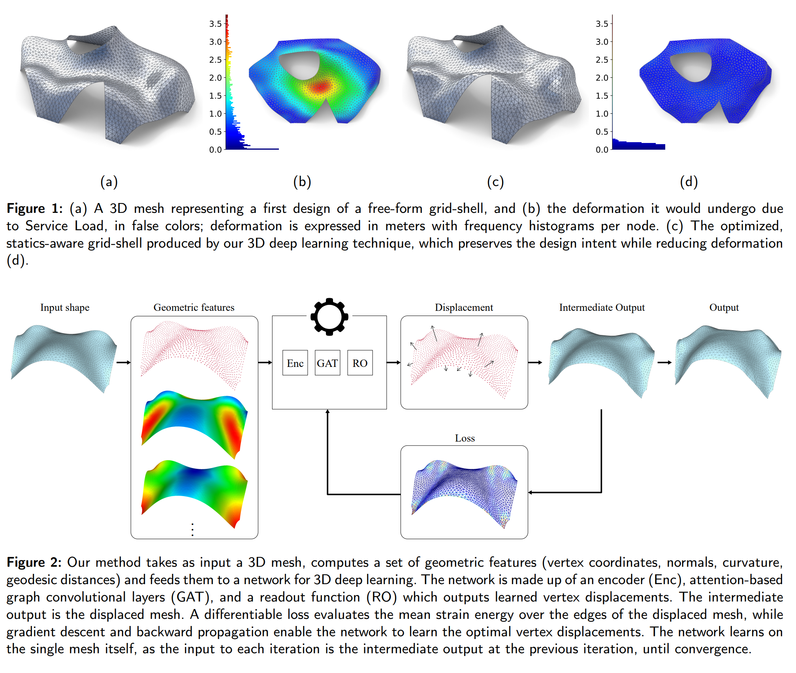

# Geometric deep learning for statics aware grid shells

**Andrea Favilli<sup>a,b</sup>, Francesco Laccone<sup>a</sup>, Paolo Cignoni<sup>a</sup>, Luigi Malomo<sup>a</sup>, Daniela Giorgi<sup>a</sup>**  
<sup>a</sup>Institute of Information Science and Technologies "A. Faedo" (ISTI), National Research Council of Italy (CNR)  
<sup>b</sup>University of Pisa (Italy)



# Installation
This code has been tested on a Windows® 10 Pro machine with a i7-6700K CPU, 32 GB of RAM, a NVIDIA GeForce GTX 1080 GPU with 8 GB of dedicated memory. It runs on Python 3.11.5 with PyTorch 2.1.1, CUDA 11.8, and PyTorch Geometric 2.4.0.

### Installing dependencies on Anaconda
We employed [Anaconda](https://www.anaconda.com/products/distribution), a popular Python distribution for data science and machine learning.
After that Anaconda is installed, we can use 'Anaconda PowerShell Prompt' to create virtual environments and run the code. From an Anaconda prompt, we move to the repository root directory and enter the command
~~~
conda env create --file environment.yml
~~~
to create an envirorment named ```GeomDL4GridShell``` that contains all the needed dependencies. We can then activate ```GeomDL4GridShell``` by typing
~~~
conda activate GeomDL4GridShell
~~~
and we are ready to run the code.

# Code usage
Into the environment ```GeomDL4GridShell```, the command
~~~
python optimization_task.py --meshpath 'meshes/<modelname>.ply' --device 'cuda' --savename <modelname>
~~~
perform shape optimization on a single input structure, encoded in the file ```<modelname>.ply```. Execution on the whole batch of examples ```models/``` is performed after
~~~
python batch_exec.py
~~~